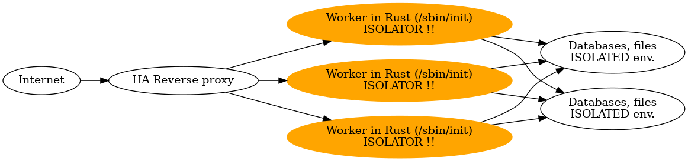

# Linux kernel and /sbin/init only system

This is a minimal example, how can running system with only a Linux kernel and single ELF binary.

## Why?

* This use a minimal resources. It can running less than 45 MB RAM.
* The /sbin/init as full user space software written in Rust, so fast, efficient and secure.
* You can create a secure architecture, because of the single /sbin/init system. So this system can't execute reverse shell, etc., because it does't contains any binaries and the system is readonly.
* The Linux distributions are very complex and weekly comes security upgrades. Security updates are very rare here, because of the minimal system.
* The start time is very fast, from start of the booting the Linux kernel and "Hello, world from Rust!" is only 1.083 second on my laptop with i7-1165G7 cpu in Qemu and initrd environment.

Here is an example for a secure architecture:

## What is sysdiag?

It serve some status information in a TCP port.

    $ echo -e "mounts\n loadavg\n proc\n meminfo" | nc IPv4_or_IPv6_addr 7878

For shutdown this VM:

    $ echo "pwroff" | nc IPv4_or_IPv6_addr 7878

## If you don't have a SLAAC router and DHCPv4 support

One of my tests I use the docker0 bridge interface for qemu. You can connect via the link local interface, but you have to give the name of interface.

    $ echo -e "meminfo\n quit" | nc fe80::5054:ff:fe12:3456%docker0 7878

For IPv4 DHCP, the udhcpd is the simplest way on host Linux.

    $ sudo apt install udhcpd
    # edit /etc/udhcpd/conf (interface docker0) and the /etc/default/udhcp (no -> yes)
    $ sudo systemctl restart udhcpd
